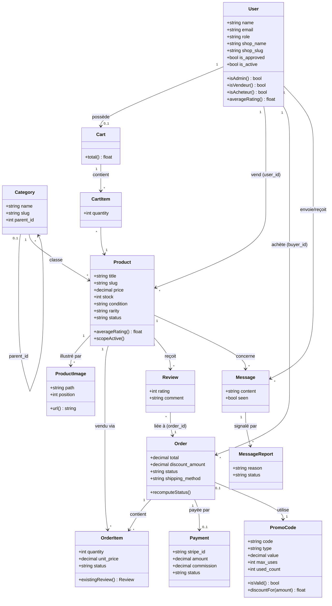
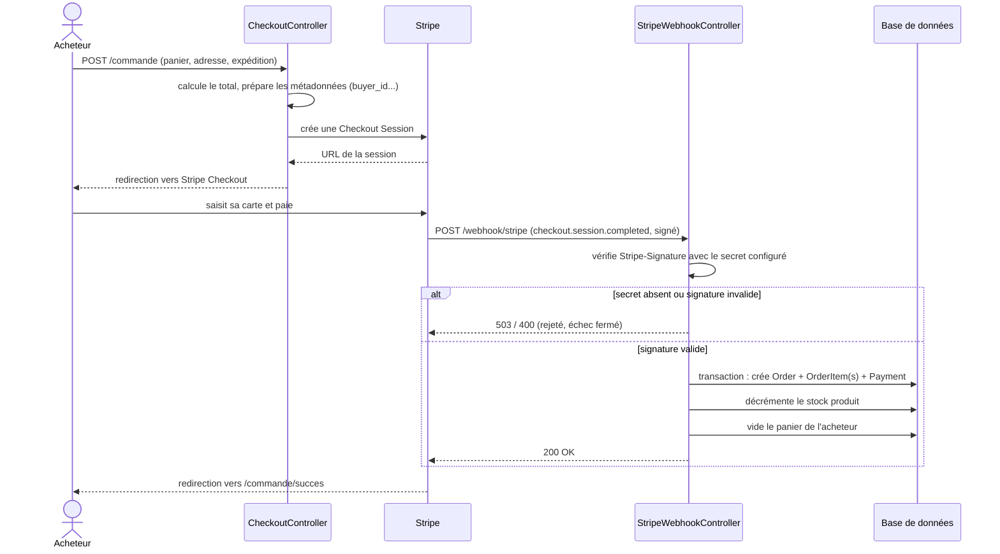

# Marketplace Pop Culture

Plateforme de vente entre particuliers d'objets pop culture (cartes à collectionner, jeux vidéo rétro, figurines, manga, goodies), réalisée dans le cadre d'un Travail de Fin d'Études — voir le [cahier des charges](#cahier-des-charges) d'origine pour le périmètre complet.

## Stack

| Domaine | Techno |
|---|---|
| Framework | Laravel 13 (PHP 8.5), Eloquent ORM |
| Frontend | Blade + Livewire 3 / Volt, Tailwind CSS 3 |
| Rôles & permissions | Spatie Laravel Permission |
| Paiement | Stripe Checkout Sessions + webhook |
| Temps réel | Laravel Reverb (auto-hébergé, remplace Pusher) |
| PDF | barryvdh/laravel-dompdf |
| Base de données | SQLite en local (zéro configuration) / MySQL en production |

## Installation

```bash
composer install
npm install
cp .env.example .env
php artisan key:generate
php artisan migrate --seed
php artisan storage:link
```

`DB_CONNECTION=sqlite` fonctionne directement sans rien configurer (le fichier `database/database.sqlite` est créé automatiquement). Pour passer en MySQL/MariaDB (recommandé en production, comme demandé au cahier des charges), voir les lignes commentées dans `.env.example`.

## Lancer le projet en local

Trois processus tournent en parallèle :

```bash
php artisan serve          # http://localhost:8000
npm run dev                # Vite (hot reload CSS/JS)
php artisan reverb:start   # WebSocket pour la messagerie temps réel
```

> Si `ws://localhost:8080` échoue dans votre navigateur, essayez `REVERB_HOST=127.0.0.1` dans `.env` (certains environnements résolvent mal `localhost` en WebSocket).

### Paiement Stripe

Le paiement fonctionne en mode dégradé sans clé configurée : le webhook rejette (503) toute requête tant que `STRIPE_WEBHOOK_SECRET` n'est pas renseigné plutôt que de faire confiance à un paiement non signé. Pour l'activer en local :

1. Créez un compte Stripe gratuit et récupérez vos clés de test sur https://dashboard.stripe.com/test/apikeys
2. Renseignez `STRIPE_KEY` et `STRIPE_SECRET` dans `.env`
3. Installez le [Stripe CLI](https://stripe.com/docs/stripe-cli) (`winget install --id Stripe.StripeCLI` sous Windows), puis lancez le forward du webhook — l'URL dépend du serveur utilisé (`php artisan serve` = port 8000, Laragon = port du vhost) :
   ```bash
   stripe listen --forward-to http://localhost:8000/webhook/stripe --api-key sk_test_...
   ```
   Gardez cette commande active dans un terminal pendant vos tests. Elle affiche un secret `whsec_...` au démarrage (ou récupérable seul via `stripe listen --print-secret --api-key sk_test_...`) : copiez-le dans `STRIPE_WEBHOOK_SECRET`.
4. Sur la page de paiement Stripe, utilisez la carte de test `4242 4242 4242 4242`, une date d'expiration future (ex. `12/34`), un CVC quelconque (ex. `123`) et un nom quelconque.
5. Après paiement, le terminal `stripe listen` doit afficher `[200] POST .../webhook/stripe` pour l'événement `checkout.session.completed` : la commande, la ligne de commande, le paiement et la décrémentation du stock se font à ce moment-là (voir `App\Http\Controllers\StripeWebhookController::fulfillOrder()`). Un `[500]` ou l'absence d'événement signale un problème à corriger avant de considérer le paiement fonctionnel — la réussite du paiement côté Stripe ne suffit pas, seul un `200` sur ce webhook garantit que la commande a bien été créée.

### Emails (Mailtrap)

Les emails (réinitialisation de mot de passe, futures notifications) partent réellement via l'API transactionnelle de Mailtrap (`railsware/mailtrap-php`, transport `mailtrap-sdk` enregistré dans `config/mail.php` par le bridge Laravel du package) — plus de `MAIL_MAILER=log`.

1. Créez un compte gratuit sur [mailtrap.io](https://mailtrap.io) et générez un token sur la page **API Tokens**.
2. Renseignez `MAILTRAP_API_KEY` dans `.env`.
3. `MAIL_FROM_ADDRESS` est réglé sur `hello@demomailtrap.co` (domaine de démo Mailtrap, fonctionne sans vérification) — à remplacer par un domaine vérifié pour un vrai envoi en production.
4. `php artisan send-mail` envoie un email de test (voir `routes/console.php`) — `{"success": true, "message_ids": [...]}` confirme que ça fonctionne.

## Comptes de test (créés par le seeder)

| Rôle | Email | Mot de passe |
|---|---|---|
| Administrateur | `admin@marketplace.test` | `password` |
| Vendeur approuvé — Cartes & Figurines Léo | `vendeur@marketplace.test` | `password` |
| Vendeur approuvé — Trading Card Kingdom | `tck@marketplace.test` | `password` |
| Vendeur approuvé — RetroPixel Games | `retropixel@marketplace.test` | `password` |
| Vendeur approuvé — Manga Corner | `mangacorner@marketplace.test` | `password` |
| Vendeur approuvé — PopGoodies Boutique | `popgoodies@marketplace.test` | `password` |
| Vendeur approuvé — Funko & Friends | `funko@marketplace.test` | `password` |
| Vendeur en attente | `vendeur.pending@marketplace.test` | `password` |
| Acheteur | `acheteur@marketplace.test` | `password` |

`php artisan migrate:fresh --seed` régénère une base propre avec ces comptes, 5 catégories, 59 produits répartis sur les 6 boutiques vendeur + la boutique "Sélection Officielle" tenue par l'admin, et une commande livrée avec avis pour avoir tout de suite des données à l'écran. Le catalogue a été volontairement réduit aux seuls produits ayant une **vraie photo** (pas de LoremFlickr générique) : 21 cartes à collectionner via [TCGdex](https://tcgdex.dev) (Pokémon) et [Scryfall](https://scryfall.com) (Magic), 9 jeux vidéo via [libretro-thumbnails](https://github.com/libretro-thumbnails) (jaquettes officielles), 12 mangas (couverture du tome 1) via [MangaDex](https://mangadex.org), et 17 figurines via la base ouverte [kennymkchan/funko-pop-data](https://github.com/kennymkchan/funko-pop-data) (23 900 Funko Pop! référencés) — quatre sources publiques sans clé API, voir `DemoDataSeeder::IMAGE_OVERRIDES`. Pour les cartes/jeux/mangas la photo est exacte ; pour les figurines c'est le bon personnage mais pas toujours la même gamme que l'annonce (Ichiban Kuji, Pokémon Center, statuette... affichés avec une Funko Pop du même personnage, faute de source ouverte pour ces gammes). Conséquence de ce nettoyage : la catégorie "Goodies" et la boutique "PopGoodies Boutique" n'ont plus aucun produit (aucune source de vraie photo n'existe pour ce type d'article générique) — l'UI gère cet état vide proprement (page boutique/catégorie affichée avec un message "aucun produit"), mais si une démo doit montrer ces deux-là avec du contenu, il faudra soit leur laisser une photo générique, soit les retirer du menu.

## Tests

```bash
php artisan test           # 54 tests (auth, autorisation par rôle, profil, panier, webhook Stripe, export RGPD, favoris, recherches...)
./vendor/bin/pint --test   # style de code
npm run build               # build production, doit sortir sans erreur ni warning
```

Points notables couverts par les tests :
- `MarketplaceAuthorizationTest` : gates de rôle (acheteur/vendeur/admin), vendeur en attente vs approuvé
- `CartManagerTest` : panier invité (session) et connecté (base de données), respect du stock, fusion à la connexion
- `StripeWebhookTest` : non-régression sur les deux bugs trouvés lors de l'audit de cette itération — le webhook rejette (503/400) tout paiement non signé ou signé avec un mauvais secret, et un webhook valide crée bien la commande/le paiement et vide le panier (c'est ce deuxième cas précis qui avait silencieusement échoué avant correction : le paiement passait côté Stripe mais aucune commande n'était créée)
- `ProfileDataExportTest` : l'export RGPD ne contient que les données du compte connecté

Une CI GitHub Actions (`.github/workflows/ci.yml`) exécute ces trois commandes à chaque push — inactive tant que ce dépôt n'a pas de remote GitHub.

## Périmètre fonctionnel réalisé

- **Comptes** : inscription acheteur (accès immédiat) / vendeur (validation admin requise), connexion, mot de passe oublié, profil (avatar, bio, adresse, infos boutique)
- **Catalogue** : accueil, liste avec filtres (catégorie, marque, état, rareté, prix) + tri + recherche, fiche produit, annuaire et profils vendeurs
- **Favoris** : ajouter/retirer un produit en un clic (catalogue et fiche produit), page dédiée `/favoris`, compteur en temps réel dans la nav
- **Recherches** (`/recherches`) : un acheteur publie ce qu'il cherche (titre, description, catégorie, budget max) ; les vendeurs approuvés peuvent répondre, éventuellement en liant une de leurs annonces ; l'auteur peut marquer la recherche comme pourvue ou la clôturer
- **Panier & commande** : panier session (invité) ou base de données (connecté, fusionné à la connexion), choix du mode d'expédition (standard / express), checkout Stripe, codes promo, facture PDF, suivi de commande
- **Messagerie** : discussion par produit entre acheteur et vendeur, temps réel (Reverb), indicateur lu/non lu, signalement
- **Avis** : notation 1-5 après livraison, affichée sur la fiche produit et le profil vendeur
- **Espace vendeur** : CRUD produits avec upload d'images, commandes reçues avec pipeline de statut et montant net après commission, statistiques mensuelles (graphique)
- **Back office admin** : statistiques globales, gestion utilisateurs (création, modification, désactivation) et vendeurs (validation, suspension), catégories, modération produits/avis, litiges de commande, messages signalés, codes promo, paramètres (taux de commission, mentions légales publiées sur `/mentions-legales`)

### Décisions techniques notables

- **SQLite en local** : le MySQL fourni par l'environnement de développement initial s'est révélé être une installation incomplète (dossier `lib/plugin` absent, `mysqld` ne démarrait pas). SQLite évite cette dépendance en local ; les migrations n'utilisent aucune syntaxe spécifique à un moteur, donc le passage à MySQL en production ne demande qu'un changement de `.env`.
- **Reverb plutôt que Pusher** : le cahier des charges autorise explicitement cette alternative auto-hébergée (section 7.1), ce qui évite de dépendre d'un compte tiers.
- **Pas de coordonnées bancaires réelles stockées** : le champ « coordonnées de versement » du profil vendeur est un simple mémo texte, avec un avertissement à l'écran. Un vrai système de versement nécessiterait Stripe Connect, hors périmètre de cette itération.
- **Statut de commande à deux niveaux** : `orders.status` (vu par l'acheteur) et `order_items.status` (piloté par chaque vendeur). Un même panier pouvant contenir des produits de plusieurs vendeurs indépendants, le statut global ne peut avancer que lorsque tous les articles ont atteint l'étape correspondante (`Order::recomputeStatus()`).

## Non couvert dans cette itération

- Déploiement réel (hébergement type Railway/Render/o2switch) — nécessite la création d'un compte hébergeur par le commanditaire ; le code est prêt (voir `.github/workflows/ci.yml` pour la suite de build/tests automatisée, inactive tant que ce dépôt n'est pas poussé sur GitHub)
- Clés Stripe/Reverb de production — à créer par le commanditaire (les clés de test fonctionnent en local, voir section Stripe ci-dessus)
- Suite de tests exhaustive à 100% — la couverture actuelle (voir section Tests) couvre l'autorisation par rôle, le panier, le webhook Stripe (y compris des tests de non-régression sur les deux bugs trouvés lors de l'audit) et l'export RGPD ; certains flows secondaires (messagerie temps réel, litiges admin) restent non testés
- API REST (Sanctum) : le stack technique du cahier des charges la mentionne, mais aucune app externe (mobile, SPA) ne consomme l'application — tout est rendu côté serveur (Blade/Livewire). Sanctum peut être activé sans changement d'architecture si un besoin apparaît.
- RGPD : le droit à l'effacement (suppression de compte) et le droit à la portabilité (export JSON de ses données depuis Profil) sont couverts ; les mentions légales détaillent les droits de l'utilisateur ; une bannière de consentement cookies est présente (purement informative — seuls des cookies de session strictement nécessaires sont posés, il n'y a rien à opter-out).

## Diagrammes UML

### Diagramme de classes



### Diagramme de séquence — paiement Stripe et création de la commande

Documente le flow où résidait le bug le plus critique trouvé cette itération (variable `$manager` absente de la closure `DB::transaction()` — le paiement Stripe réussissait mais la commande n'était jamais créée) : montre pourquoi la vérification de signature (fail-closed) et le webhook sont le seul moment où la commande existe réellement.



### ERD texte (référence rapide)

```
users ──┬──< products >──── categories (auto-référencée via parent_id)
        │       │
        │       ├──< product_images
        │       ├──< order_items >── orders ──< payments
        │       ├──< reviews (via order_id + product_id)
        │       └──< messages >── message_reports
        │
        ├──< carts ──< cart_items >── products
        └──< orders (buyer_id)

orders ──< order_items >── users (seller_id, denormalisé)
orders ── promo_codes (nullable)
```

Champs clés par table : voir `database/migrations/`. Statuts pipeline (`orders.status`, `order_items.status`) : `en_attente → acceptee → expediee → livree`.

## Manuel utilisateur rapide

**Acheteur** : s'inscrire via « Je suis acheteur » → parcourir `/produits` → ajouter au panier → `/panier` → « Passer commande » → payer via Stripe → suivre dans « Mes commandes », laisser un avis une fois « Livrée ».

**Vendeur** : s'inscrire via « Je suis vendeur » → attendre la validation admin (bannière visible sur le tableau de bord tant que non approuvé) → une fois approuvé, `/vendeur/produits/creer` pour publier, `/vendeur/commandes` pour faire avancer le statut de chaque article vendu.

**Administrateur** : `/admin` centralise tout — valider les vendeurs en attente (`/admin/vendeurs`), modérer produits/avis/messages signalés, gérer les codes promo et le taux de commission (`/admin/parametres`).

## Cahier des charges

Document d'origine fourni par le commanditaire, résumant les sections 1 à 14 (contexte, périmètre fonctionnel, spécifications techniques, sécurité, planning, critères de validation). Non inclus dans ce dépôt.
